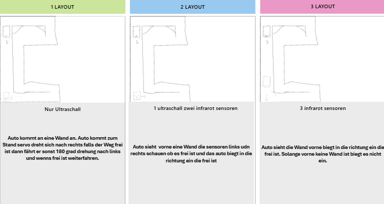

# 📌 Projektname

Kurze Beschreibung deines Projekts (1–2 Sätze).

---

## 📊 Konzeptvergleich

| Konzept | Vorteile | Nachteile |
|--------|----------|-----------|
| **Konzept A** | ✅ garantierte funktion   ✅ wenig hardware | ❌ zu langsam   |
| **Konzept B** | ✅ schnell | ❌ komplexere programierung nötig |
| **Konzept C** | ✅ schneller   | ❌ komplexere programierung nötig |

---

## 🖼️ Skizzen & Screenshots
| **Konzepte** |  |

## ✅ Arbeitspakete
- [ ] **Konzept Auswahl**
- [ ] **Sensor Positionirung**
- [ ] **Sensor Kalibrierung**
- [ ] **Sensor Programierung**
- [ ] **Sensor Test**

## 📝 Fazit
Gewählt wurde Konzept C da diese im Gegensatz zu Konzept B einen IR-Sensor benutzt und viel schneller messungen tätigen kann als ein Ultraschallsensor.
